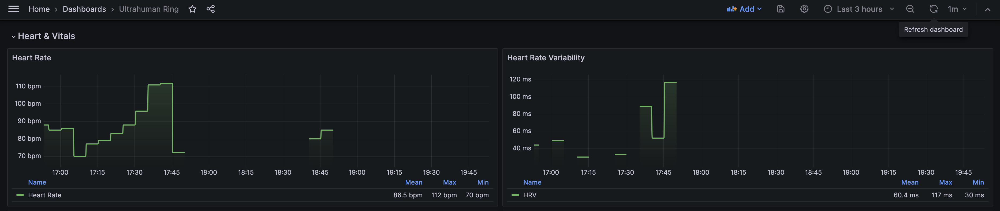

# uh-ring

A CLI tool for Ultrahuman Ring metrics. Fetch your health data from the Ultrahuman API and visualize it with Grafana.

## Installation

```bash
go install github.com/Hunter-Thompson/uh-ring@latest
```

## Quick Start

### 1. Get your API token

Get your Ultrahuman Partner API token from https://vision.ultrahuman.com/developer-docs

### 2. Configure the token

```bash
cp .env.example .env
```

Edit `.env` and add your token:

```
ULTRAHUMAN_API_TOKEN=your_api_token_here
```

### 3. Start the stack

```bash
docker compose up -d
```

### 4. View your metrics

Open Grafana at http://localhost:3000 (login: admin/admin) and navigate to the **Ultrahuman Ring** dashboard.

## Features

- **CLI Mode**: Query individual metrics or display a full dashboard in your terminal
- **Push-based Architecture**: Time series data is pushed to Prometheus with original sensor timestamps
- **Pre-configured Stack**: Docker Compose setup with Prometheus and Grafana (90-day retention)
- **Health Metrics**: Heart rate, HRV, SpO2, skin temperature, steps, and glucose

## CLI Usage

### Prerequisites

- Go 1.21+ (for local build)
- Ultrahuman Partner API token

### Build

```bash
go build -o uh-ring .
export ULTRAHUMAN_API_TOKEN=your_api_token_here
```

### Commands

```bash
# Display all metrics
./uh-ring

# Query specific metrics
./uh-ring hr              # Heart rate (BPM)
./uh-ring hrv             # Heart rate variability (ms)
./uh-ring sleep           # Sleep score
./uh-ring steps           # Step count
./uh-ring glucose         # Glucose level (mg/dL)
```

### Example Output

```
══════════════════════════════════════════════════════════
  ULTRAHUMAN METRICS | Timezone: Asia/Kolkata
══════════════════════════════════════════════════════════

  Date: 2026-01-07
──────────────────────────────────────────────────────────

  HEART RATE
      Last: 85 BPM
      - 75 BPM @ 15:35
      - 85 BPM @ 15:40
      ...

  SKIN TEMPERATURE
      Last: 33.0°C
      - 30.7°C @ 15:37
      - 31.6°C @ 15:42
      ...

  SPO2 (Blood Oxygen)
      Average: 97%
      - 97% @ 15:35
      - 97% @ 15:40
      ...

  HEART RATE VARIABILITY
      Last: 0 ms
      - 57 ms @ 15:45
      - 64 ms @ 15:55
      ...

  STEPS
      Total: 474 | Avg: 12

  MOVEMENT INDEX
      Score: 61

  ACTIVE MINUTES
      Value: 5 min

══════════════════════════════════════════════════════════
```

### Server Mode

```bash
./uh-ring --port 8080 --interval 60 --remote-write-url http://localhost:9090/api/v1/write serve
```

Options:
- `--port`: HTTP port for health/status endpoints (default: 8080)
- `--interval`: Fetch interval in seconds (default: 60)
- `--remote-write-url`: Prometheus remote write endpoint

Endpoints:
- `/health` - Health check
- `/status` - Current status and last fetch time

## Grafana Dashboard Metrics



The following time series metrics are pushed to Prometheus and displayed in Grafana:

| Metric | Prometheus Name | Unit |
|--------|-----------------|------|
| Heart Rate | `ultrahuman_heart_rate_bpm` | bpm |
| HRV | `ultrahuman_hrv_ms` | ms |
| SpO2 | `ultrahuman_spo2_percent` | % |
| Skin Temperature | `ultrahuman_skin_temperature_celsius` | °C |
| Steps | `ultrahuman_steps_total` | count |
| Glucose | `ultrahuman_glucose_mg_dl` | mg/dL |

## Use Cases

### Add heart rate to your shell prompt


```bash
# In .zshrc or .bashrc
hr_prompt() {
  local hr=$(./uh-ring hr 2>/dev/null)
  [[ -n "$hr" ]] && echo "♥${hr}"
}
PROMPT='$(hr_prompt) %~ $ '
```

### Status bar integration (slstatus, i3status, polybar)

```bash
# slstatus config.h
{ hr_status, NULL, 60, NULL },

# Where hr_status script is:
#!/bin/sh
echo "♥ $(uh-ring hr) bpm"
```

### Daily health log

```bash
# Cron job to log daily metrics
0 8 * * * echo "$(date +%F),$(uh-ring hr),$(uh-ring hrv),$(uh-ring sleep)" >> ~/health.csv
```

### Historical data analysis

Query the Prometheus API directly for historical trends:

```bash
# Last 7 days average heart rate
curl -s 'http://localhost:9090/api/v1/query?query=avg_over_time(ultrahuman_heart_rate_bpm[7d])'
```

## CLI Metrics

The CLI displays additional daily aggregate metrics not available in Grafana:

| Command | Description |
|---------|-------------|
| `sleep_score` | Overall sleep score |
| `recovery` | Recovery score |
| `movement_index` | Daily movement index |
| `total_sleep` | Total sleep duration |
| `deep_sleep` | Deep sleep duration |
| `rem_sleep` | REM sleep duration |
| `sleep_efficiency` | Sleep efficiency percentage |

Run `./uh-ring` to see all available metrics.

## Project Structure

```
.
├── main.go              # Application source (builds to uh-ring)
├── Dockerfile           # Multi-stage build
├── docker-compose.yml   # Full stack deployment
├── prometheus.yml       # Prometheus config
├── .env.example         # Environment template
└── grafana/
    └── provisioning/    # Grafana auto-provisioning
        ├── dashboards/
        │   └── ultrahuman.json
        └── datasources/
            └── datasources.yml
```

## License

MIT
